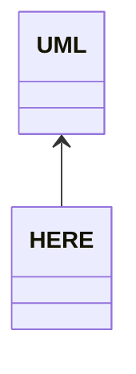
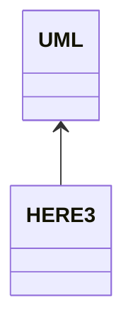

# Labyrinth
Progetto realizzato da
- Carletti Lorenzo (lorenzo.carletti3@studio.unibo.it)
- Catena Matteo (matteo.catena3@studio.unibo.it)
- Dall'Ara Lorenzo (lorenzo.dallara2@studio.unibo.it)
- Rocchi Mattia (mattia.rocchi2@studio.unibo.it)

## Indice

- [Labyrinth](#labyrinth)
  - [Indice](#indice)
  - [1. Analisi](#1-analisi)
    - [1.1 Requisiti](#11-requisiti)
      - [1.1.1 Requisiti funzionali](#111-requisiti-funzionali)
      - [1.1.2 Requisiti non funzionali](#112-requisiti-non-funzionali)
    - [1.2 Analisi e modello del dominio](#12-analisi-e-modello-del-dominio)
  - [2. Design](#2-design)
    - [2.1 Architettura](#21-architettura)
    - [2.2 Design Dettagliato](#22-design-dettagliato)
      - [2.2.1 Carletti Lorenzo](#221-carletti-lorenzo)
      - [2.2.2 Catena Matteo](#222-catena-matteo)
      - [2.2.3 Dall'Ara Lorenzo](#223-dallara-lorenzo)
      - [2.2.4 Rocchi Mattia](#224-rocchi-mattia)
  - [3. Sviluppo](#3-sviluppo)
    - [3.1 Testing automatico](#31-testing-automatico)
    - [3.2 Note di sviluppo](#32-note-di-sviluppo)
      - [3.2.1 Carletti Lorenzo](#321-carletti-lorenzo)
      - [3.2.2 Catena Matteo](#322-catena-matteo)
      - [3.2.3 Dall'Ara Lorenzo](#323-dallara-lorenzo)
      - [3.2.4 Rocchi Mattia](#324-rocchi-mattia)
  - [4. Commenti finali](#4-commenti-finali)
    - [4.1 Autovalutazione e lavori futuri](#41-autovalutazione-e-lavori-futuri)
      - [4.1.2 Carletti Lorenzo](#412-carletti-lorenzo)
  - [Appendice A: Guida utente](#appendice-a-guida-utente)
  - [Appendice B: Esercitazioni di laboratorio](#appendice-b-esercitazioni-di-laboratorio)
    - [B.01 lorenzo.carletti3@studio.unibo.it](#b01-lorenzocarletti3studiouniboit)
    - [B.02 matteo.catena3@studio.unibo.it](#b02-matteocatena3studiouniboit)


## 1. Analisi
Il software proposto da questo gruppo si pone come obiettivo quello di realizzare un gioco ispirato al gioco da tavolo "Labirinto Magico", pubblicato da Ravensburger nel 1986, modificando alcune caratteristiche fondamentali di gioco per crearne una versione originale.

### 1.1 Requisiti
#### 1.1.1 Requisiti funzionali
- Il gioco deve poter supportare da 2 a 4 giocatori, che seguono un sistema a turni.
- I giocatori devono poter raccogliere dei materiali all'interno del labirinto.
- Il gioco deve contenere delle missioni, visibili e completabili da tutti i giocatori.
- Ogni missione ha associato un punteggio che viene dato al giocatore che la completa.
- Una volta che una missione è stata completata da un giocatore non può essere completata una seconda volta.
- Il gioco termina quando non ci sono più missioni da poter completare, stilando una classifica dei giocatori in base al punteggio.
- L'utente deve poter configurare i parametri di gioco prima di iniziare la partita.
- Il gioco deve poter permettere di fare più partite consecutive.
- Il gioco deve mostrarsi all'utente come una finestra GUI (`Graphical User Interface`)
#### 1.1.2 Requisiti non funzionali
- Il gioco deve essere abbastanza simile per qualcuno che ha già giocato al gioco originale.
- Il gioco deve ottimizzare l'utilizzo delle risorse disponibili, senza soffrire di cali di performance.
- La finestra di gioco deve poter essere ridimensionata dall'utente.
### 1.2 Analisi e modello del dominio
In una partita di Labyrinth le entità principali che interagiscono tra loro sono le seguenti:
- Labirinto.
- Tessere.
- Giocatori.
- Materiali.
- Oggetti missione.

Il labirinto rappresenta l'insieme delle tessere, dove queste sono posizionate in una griglia.
I giocatori possono interagire con il labirinto, modificandolo tramite spostamento o rotazione di tessere.
Nel caso il giocatore desideri di spostare le tessere, lo potrà fare scegliendo una riga o una colonna e la direzione di spostamento.
Nel caso in cui il giocatore desideri di ruotare delle tessere, è limitato alla rotazione di una sola tessera tra quelle adiacenti a dove si trova il giocatore, incluse le tessere diagonali.

Le tessere del labirinto sono aperte nelle quattro direzioni cardinali, un giocatore può spostarsi tra le due tessere solo se entrambe le tessere coinvolte sono aperte nella direzione d'interesse.

I giocatori, oltre al punteggio di gioco, possono collezionare più tipologie di materiali alla volta, che vengono salvati concettualmente in un inventario.

Ogni oggetto missione è caratterizzato da due parametri, che sono la tipologia di materiale richiesto e la quantità richiesta per essere completata.
Il giocatore che vuole completare la missione deve avere il materiale specificato in una quantità pari o superiore alla richiesta dall'oggetto.

[UML DEDICATO AL MODEL DEL GIOCO]
Labirinto = Interfaccia Board
Tessere = Interfaccia Tile
Giocatori = Interfaccia Player
Materiale = Enum Material
Missione = Interfaccia Item



## 2. Design
### 2.1 Architettura
Il gioco è suddiviso concettualmente in scene, una per il menu iniziale, una per la fase di gioco e una terza per i risultati alla fine della partita. Ognuna di queste scene segue il pattern architetturale MVC (Model-View-Controller).
Ogni scena si compone astrattamente di una classe controller, una classe view e una terza classe che gestisce gli input da tastiera. Queste tre tipologie di classi vengono implementate individualmente per ogni scena effettivamente presente nel gioco.
La coordinazione tra le scene viene gestita da una classe esterna chiamata `Engine` e grazie all'interfaccia `Executor`, che viene implementata dalle classi controller delle tre scene.

[UML DEDICATO A VISUALIZZARE LA STRUTTURA DELLA SCENA GAME]


[UML DEDICATO A VISUALIZZARE LA RELAZIONE TRA ENGINE, EXECUTOR E CONTROLLER]


### 2.2 Design Dettagliato
#### 2.2.1 Carletti Lorenzo
#### 2.2.2 Catena Matteo
- **Problema:** Il game loop principale responsabile per l'esecuzione del codice deve poter eseguire in momenti separati la classe controller del menu, la classe controller del gameplay e quella controller dei risultati.
La classe che gestisce il game loop principale non dovrebbe definire al suo interno quali classi vengono eseguite, perchè ciò limita notevolmente la riusabilità del codice.
Inoltre lo scambio tra i controller dovrebbe essere possibile anche se le classi non hanno riferimenti diretti agli altri controller che devono essere eseguiti.
**Soluzione:** Design della classcom.ccdr.labyrinth.game.tiles.GuildTile`Executor`.
La classe `Engine` può eseguire un solo oggetto `Executor` alla volta, ma attraverso il metodo `changeExecutor` si può ordinare alla classe `Engine` di cambiare *quale* oggetto `Executor` deve essere eseguito da quel momento in poi.

- **Problema:** Quando si passa da un controller al successivo, questo richiede anche un trasferimento di informazioni. Un esempio di ciò è la configurazione del gioco, che deve andare dal menu al controller di gioco.
Dato che gli scambi tra controller sono di tipo circolare (da menu a gioco, da gioco a risultati, da risultati a menu), non si può mantenere nel controller di partenza il riferimento al controller successivo passandolo come parametro del costruttore
**Soluzione:** è stato utilizzato il pattern observer, definendo degli "eventi" quando è richiesto il passaggio da un controller al successivo.
In questo modo le classi controller hanno codice concettualmente separato, senza nessun riferimento diretto al controller successivo, rendendo possibile fare uno scambio tra i controller in modo circolare e poter testare individualmente le classi in modo automatico.

- **Problema:** Come ricevere gli input della tastiera, che vengono generati da JavaFX, per poi eseguire delle funzioni nei vari controller in modo tale da mantenere netta la separazione tra view e controller nel pattern MVC.
**Soluzione:** interfaccia `JFXInputSource`, la sua interfaccia interna `Receiver` e le interfacce `*Inputs`.
```mermaid
(grafico uml con esempio soltanto per come vengono gestiti gli input per il menu)
```
Il flusso degli input del giocatore*

- **Problema:** sorgenti nel labirinto
**Soluzione:** All'interno del labirinto ci sono delle tessere speciali con lo scopo di generare un materiale specifico in maggiore quantità, durante lo svolgimento della partita. Con il termine "Sorgente" ci si riferisce a una di queste tessere speciali.
Questa non è l'unica modalità con cui i giocatori possono ottenere materiali. Le tessere che compongono il labirinto possono contenere all'interno materiali aggiuntivi limitati, che vengono consegnati al primo giocatore che ci passa sopra.

#### 2.2.3 Dall'Ara Lorenzo
#### 2.2.4 Rocchi Mattia

## 3. Sviluppo
### 3.1 Testing automatico

### 3.2 Note di sviluppo
#### 3.2.1 Carletti Lorenzo
#### 3.2.2 Catena Matteo
- Utilizzo di JavaFX per la gestione della parte visuale e della ricezione degli input del giocatore.
Permalink:
- Utilizzo di lambda functions, per esempio nel collegamento tra i diversi controller
Permalink:
- Utilizzo di stream sulle collezioni
Permalink:
- Utilizzo di classi generiche
Permalink:
#### 3.2.3 Dall'Ara Lorenzo
- Utilizzo di Optional
Permalink:
#### 3.2.4 Rocchi Mattia

## 4. Commenti finali
### 4.1 Autovalutazione e lavori futuri
#### 4.1.2 Carletti Lorenzo

## Appendice A: Guida utente

## Appendice B: Esercitazioni di laboratorio
### B.01 lorenzo.carletti3@studio.unibo.it
- Laboratorio 09: https://virtuale.unibo.it/mod/forum/discuss.php?d=149231#p211384
- Laboratorio 10: https://virtuale.unibo.it/mod/forum/discuss.php?d=150252#p212708
- Laboratorio 11: https://virtuale.unibo.it/mod/forum/discuss.php?d=151542#p213918
### B.02 matteo.catena3@studio.unibo.it
- Laboratorio 07: https://virtuale.unibo.it/mod/forum/discuss.php?d=147598#p209276
- Laboratorio 08: https://virtuale.unibo.it/mod/forum/discuss.php?d=148025#p209762
- Laboratorio 09: https://virtuale.unibo.it/mod/forum/discuss.php?d=149231#p211482
- Laboratorio 10: https://virtuale.unibo.it/mod/forum/discuss.php?d=150252#p212700
- Laboratorio 11: https://virtuale.unibo.it/mod/forum/discuss.php?d=151542#p213921
