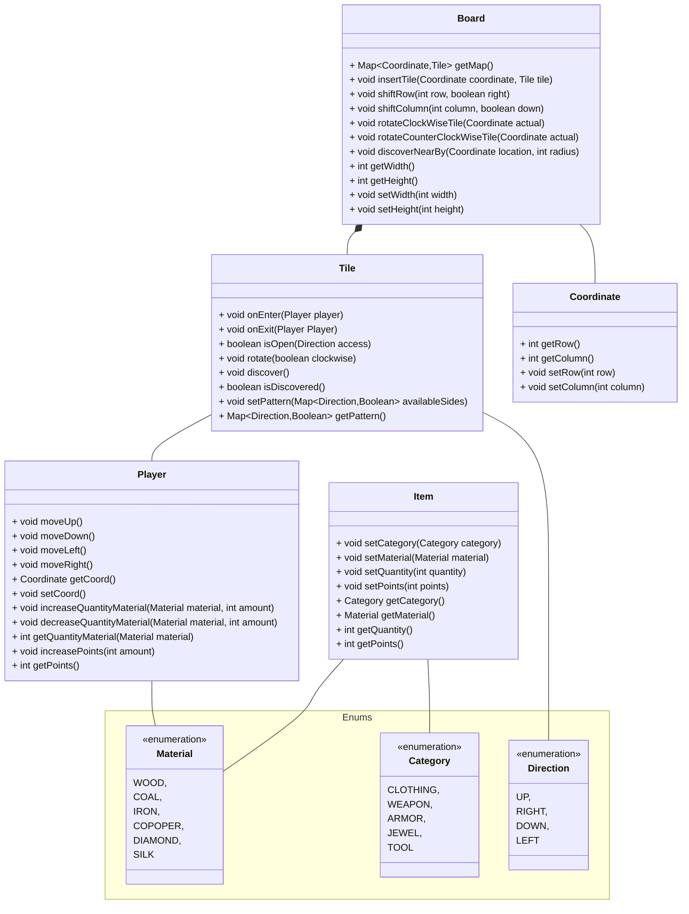
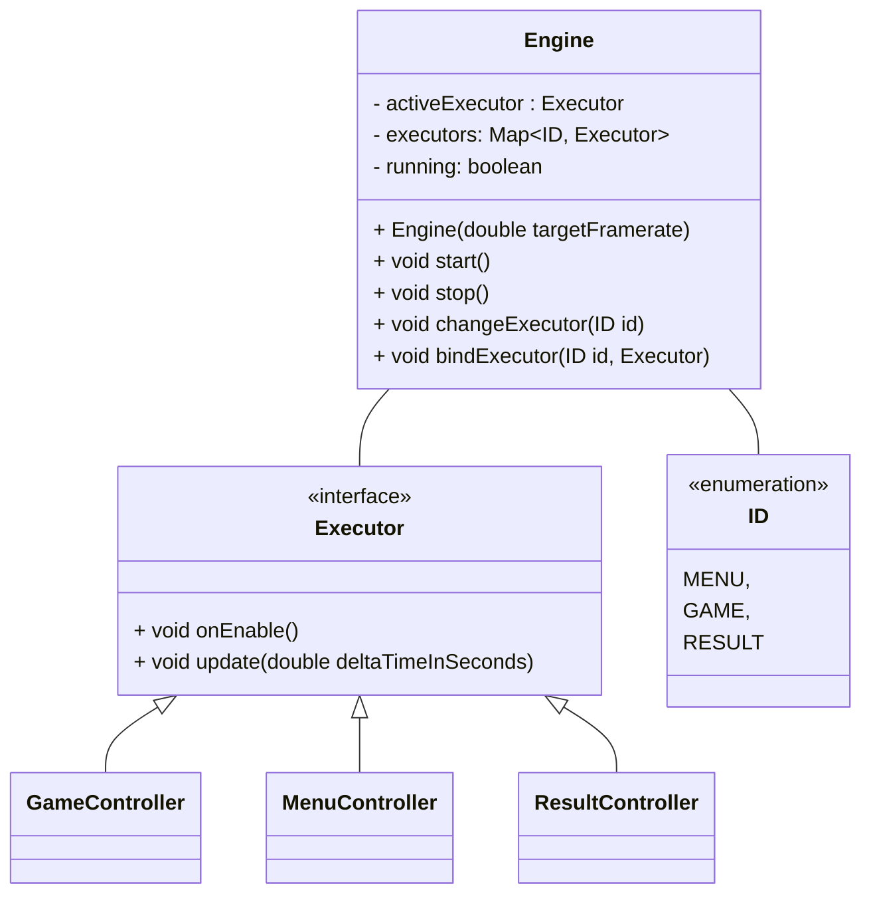
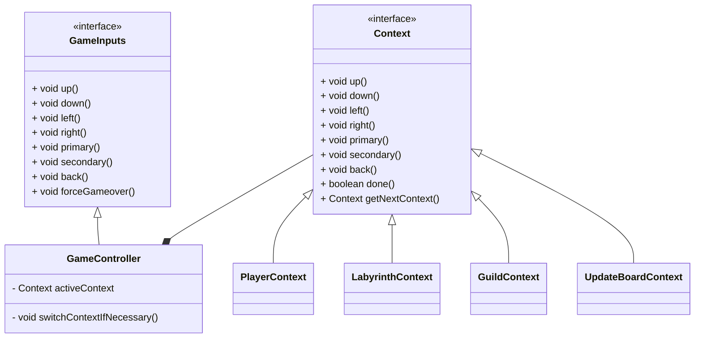
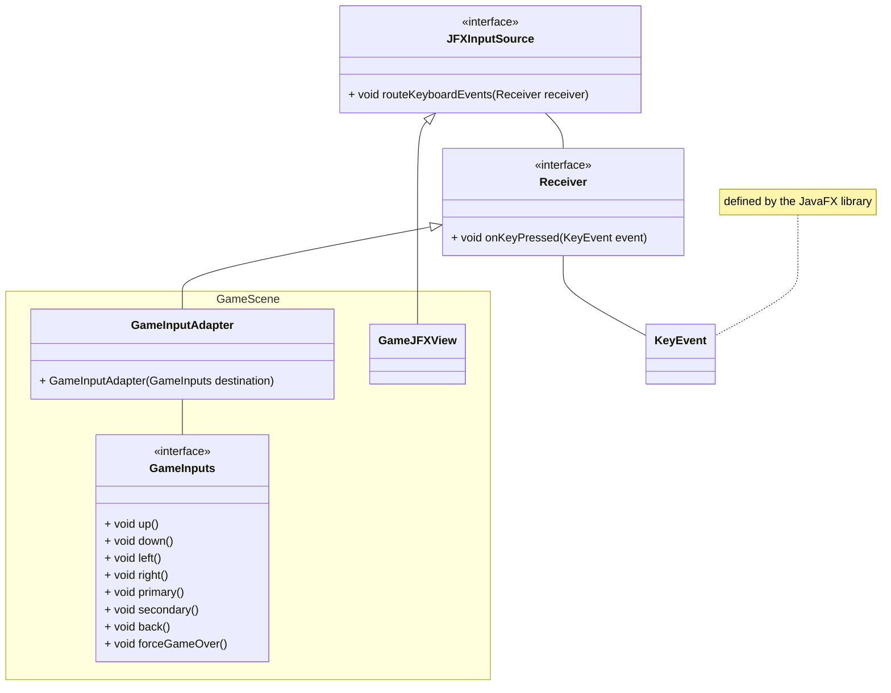
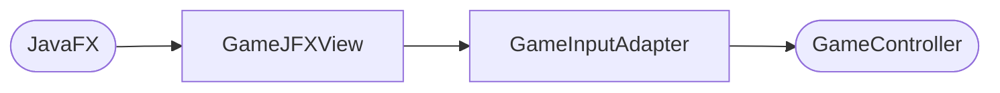

# Labyrinth
Progetto realizzato da
- Carletti Lorenzo (lorenzo.carletti3@studio.unibo.it)
- Catena Matteo (matteo.catena3@studio.unibo.it)
- Dall'Ara Lorenzo (lorenzo.dallara2@studio.unibo.it)
- Rocchi Mattia (mattia.rocchi2@studio.unibo.it)

## Indice

- [Labyrinth](#labyrinth)
  - [Indice](#indice)
  - [1. Analisi](#1-analisi)
    - [1.1 Requisiti](#11-requisiti)
      - [1.1.1 Requisiti funzionali](#111-requisiti-funzionali)
      - [1.1.2 Requisiti non funzionali](#112-requisiti-non-funzionali)
    - [1.2 Analisi e modello del dominio](#12-analisi-e-modello-del-dominio)
  - [2. Design](#2-design)
    - [2.1 Architettura](#21-architettura)
    - [2.2 Design Dettagliato](#22-design-dettagliato)
      - [2.2.1 Carletti Lorenzo](#221-carletti-lorenzo)
      - [2.2.2 Catena Matteo](#222-catena-matteo)
      - [2.2.3 Dall'Ara Lorenzo](#223-dallara-lorenzo)
      - [2.2.4 Rocchi Mattia](#224-rocchi-mattia)
  - [3. Sviluppo](#3-sviluppo)
    - [3.1 Testing automatico](#31-testing-automatico)
    - [3.2 Note di sviluppo](#32-note-di-sviluppo)
      - [3.2.1 Carletti Lorenzo](#321-carletti-lorenzo)
      - [3.2.2 Catena Matteo](#322-catena-matteo)
      - [3.2.3 Dall'Ara Lorenzo](#323-dallara-lorenzo)
      - [3.2.4 Rocchi Mattia](#324-rocchi-mattia)
  - [4. Commenti finali](#4-commenti-finali)
    - [4.1 Autovalutazione e lavori futuri](#41-autovalutazione-e-lavori-futuri)
      - [4.1.1 Carletti Lorenzo](#411-carletti-lorenzo)
      - [4.1.2 Catena Matteo](#412-catena-matteo)
      - [4.1.3 Dall'Ara Lorenzo](#413-dallara-lorenzo)
      - [4.1.4 Rocchi Mattia](#414-rocchi-mattia)
  - [Appendice A: Guida utente](#appendice-a-guida-utente)
    - [A.1 Scena del menu](#a1-scena-del-menu)
    - [A.2 Scena di gioco](#a2-scena-di-gioco)
      - [Fase 1: Modifica del Labirinto](#fase-1-modifica-del-labirinto)
        - [1.1 Modalità spostamento](#11-modalità-spostamento)
        - [1.2 Modalità di rotazione](#12-modalità-di-rotazione)
      - [Fase 2: Movimento dei giocatori](#fase-2-movimento-dei-giocatori)
      - [Fase 3: Interazione con la gilda](#fase-3-interazione-con-la-gilda)
    - [A.3 Scena dei risultati](#a3-scena-dei-risultati)
  - [Appendice B: Esercitazioni di laboratorio](#appendice-b-esercitazioni-di-laboratorio)
    - [B.1 lorenzo.carletti3@studio.unibo.it](#b1-lorenzocarletti3studiouniboit)
    - [B.2 matteo.catena3@studio.unibo.it](#b2-matteocatena3studiouniboit)

## 1. Analisi
Il software proposto da questo gruppo si pone come obiettivo quello di realizzare un gioco ispirato a "Labirinto Magico", pubblicato da Ravensburger nel 1986, modificando alcune caratteristiche fondamentali di gioco per crearne una versione originale.

### 1.1 Requisiti
#### 1.1.1 Requisiti funzionali
- Il gioco deve poter supportare da 2 a 4 giocatori, che seguono un sistema a turni.
- I giocatori devono poter raccogliere dei materiali all'interno del labirinto.
- Il gioco deve contenere delle missioni, visibili e completabili da tutti i giocatori.
- Ogni missione ha associato un punteggio che viene dato al giocatore che la completa.
- Una volta che una missione è stata completata da un giocatore non può essere completata una seconda volta.
- Il gioco termina quando non ci sono più missioni da poter completare, stilando una classifica dei giocatori in base al punteggio.
- L'utente deve poter configurare i parametri di gioco prima di iniziare la partita.
- Il gioco deve poter permettere di fare più partite consecutive.
- Il gioco deve mostrarsi all'utente come una finestra GUI (`Graphical User Interface`)
#### 1.1.2 Requisiti non funzionali
- Il gioco deve essere abbastanza simile per qualcuno che ha già giocato al gioco originale.
- Il gioco deve ottimizzare l'utilizzo delle risorse disponibili, senza soffrire di cali di performance.
- La finestra di gioco deve poter essere ridimensionata dall'utente.
### 1.2 Analisi e modello del dominio
In una partita di Labyrinth le entità principali che interagiscono tra loro sono le seguenti:
- Labirinto.
- Tessere.
- Giocatori.
- Materiali.
- Oggetti missione.

Il labirinto è l'insieme delle tessere, posizionate in una griglia.
Queste possono essere aperte nelle quattro direzioni cardinali.
Un giocatore può spostarsi tra le due tessere solo se entrambe le tessere permettono il passaggio nella direzione d'interesse.

I giocatori possono interagire con il labirinto, modificandolo tramite spostamento o rotazione di tessere.
Nel caso il giocatore desideri spostare le tessere, potrà scegliere una riga o una colonna e la direzione di spostamento.
Nel caso in cui il giocatore desideri di ruotare delle tessere, è limitato alla rotazione di una sola tessera tra quelle adiacenti a dove si trova il giocatore, incluse le tessere diagonali.

I giocatori, oltre al punteggio di gioco, possono collezionare più tipologie di materiali alla volta, che vengono salvati concettualmente in un inventario.

Ogni oggetto missione è caratterizzato da tre parametri, che sono la categoria di oggetto, la tipologia di materiale richiesto e la quantità richiesta di quest'ultimo per essere completata.
Il giocatore che vuole completare la missione deve avere il materiale specificato in una quantità pari o superiore alla richiesta dall'oggetto.

## 2. Design
### 2.1 Architettura
Il gioco è suddiviso concettualmente in scene, una per il menu iniziale, una per la fase di gioco e una terza per i risultati alla fine della partita. Ognuna di queste scene segue il pattern architetturale MVC (`Model-View-Controller`).
Ogni scena si compone astrattamente di una classe controller, una classe view e una terza classe che gestisce gli input da tastiera. Queste tre tipologie di classi vengono implementate individualmente per ogni scena effettivamente presente nel gioco.
La coordinazione tra le scene viene gestita da una classe esterna chiamata `Engine` e dall'interfaccia `Executor`, che viene implementata dalle classi controller delle tre scene.

`GameController` internamente implementa le varie fasi possibili di un giocatore attraverso l'interfaccia `Context`

### 2.2 Design Dettagliato
#### 2.2.1 Carletti Lorenzo

#### 2.2.2 Catena Matteo
- **Problema:** Il game loop principale responsabile per l'esecuzione del codice deve poter eseguire in momenti separati la classe controller del menu, la classe controller del gameplay e quella controller dei risultati.
La classe che gestisce il game loop principale non dovrebbe definire al suo interno quali classi vengono eseguite, perchè ciò limita notevolmente la riusabilità del codice.
Inoltre lo scambio tra i controller dovrebbe essere possibile anche se le classi non hanno riferimenti diretti agli altri controller che devono essere eseguiti.
**Soluzione:** Design della classe `Engine` e della classe `Executor`.

La classe `Engine` può eseguire un solo oggetto `Executor` alla volta, ma attraverso il metodo `changeExecutor` si può ordinare alla classe `Engine` di cambiare *quale* oggetto `Executor` deve essere eseguito da quel momento in poi.

- **Problema:** Quando si passa da un controller al successivo, questo richiede anche un trasferimento di informazioni. Un esempio di ciò è la configurazione del gioco, che deve andare dal menu al controller di gioco.
Dato che gli scambi tra controller sono di tipo circolare (da menu a gioco, da gioco a risultati, da risultati a menu), non si può mantenere nel controller di partenza il riferimento al controller successivo passandolo come parametro del costruttore
**Soluzione:** è stato utilizzato il pattern observer, definendo degli "eventi" quando è richiesto il passaggio da un controller al successivo.
In questo modo le classi controller hanno codice concettualmente separato, senza nessun riferimento diretto al controller successivo, rendendo possibile fare uno scambio tra i controller in modo circolare e poter testare individualmente le classi in modo automatico.

- **Problema:** Come ricevere gli input della tastiera, che vengono generati da JavaFX, per poi eseguire delle funzioni nei vari controller in modo tale da mantenere netta la separazione tra view e controller nel pattern MVC.
**Soluzione:** interfaccia `JFXInputSource` e la sua interfaccia interna `Receiver`.

Nel caso in cui la scena attiva sia quella di gioco, gli eventi seguono un percorso, attraverso classi concrete, di questo tipo:

`GameJFXView` si occupa di configurare il necessario per JavaFX in modo tale da poter spedire gli eventi della tastiera alla classe `GameInputAdapter`, passata attraverso il metodo `routeKeyboardEvents`
`GameInputAdapter` si occupa nella funzione `onKeyPressed` di ricevere gli eventi di tipo `KeyInput` e mappare i tasti necessari in chiamate di funzioni di `GameController`.
In questo modo `GameController` può definire attraverso l'interfaccia `GameInputs` le funzioni necessarie per il suo funzionamento, senza doversi preoccupare di *come* le funzioni vengono chiamate dall'esterno.

La gestione degli input per le scene `Menu` e `Result` seguono una struttura e utilizzo analoga a quella descritta per la scena `Game`.
Le classi coinvolte avranno il prefisso `Menu` oppure `Result` al posto del prefisso `Game`, ma i ruoli delle classi sono gli stessi per tutte e tre le scene.

- **Problema:** sorgenti nel labirinto
**Soluzione:** All'interno del labirinto ci sono delle tessere speciali con lo scopo di generare un materiale specifico in maggiore quantità, durante lo svolgimento della partita. Con il termine "Sorgente" ci si riferisce a una di queste tessere speciali.
Questa non è l'unica modalità con cui i giocatori possono ottenere materiali. Le tessere che compongono il labirinto possono contenere all'interno materiali aggiuntivi limitati, che vengono consegnati al primo giocatore che ci passa sopra.

#### 2.2.3 Dall'Ara Lorenzo
#### 2.2.4 Rocchi Mattia

## 3. Sviluppo
### 3.1 Testing automatico
Per implementare le classi di test è stata utilizzata la suite JUnit 5. I test, tutti automatici, sono stati utilizzati per verificare il corretto funzionamento delle classi principali.
Le classi di test realizzate sono le seguenti:
- `BoardGenerationTest`: verifica la corretta generazione del labirinto e delle tessere.
- `EngineTest`: verifica il corretto funzionamento della classe Engine.
- `GuildTileTest`: verifica la generazione delle missioni, i controlli sul menu della gilda e l'attribuzione dei punti bonus.
- `ImageLoaderTest`: verifica il corretto caricamento delle immagini.
- `MenuControllerTest`: verifica il corretto funzionamento degli eventi interni alla classe MenuController.
- `MenuElementTest`: verifica il corretto funzionamento della struttura interna al menu principale.
- `PlayerTest`: verifica il movimento, l'inventario e l'attribuzione dei punti di un singolo giocatore.
- `ResultControllerTest`: verifica il passaggio di scena dai risultati al menu principale.
- `SourceTileTest`: verifica il corretto funzionamento delle sorgenti e l'attribuzione dei materiali ai giocatori.
- `TileInteractionTest`: verifica la corretta manipolazione del labirinto e delle singole tessere.

### 3.2 Note di sviluppo
#### 3.2.1 Carletti Lorenzo
- Utilizzo di JavaFX per visualizzare le informazioni dei giocatori:

https://github.com/Code-Commit-Debug-Revert/OOP23-Labyrinth/blob/a7fb0ab2697a99431b1e937be47ad1634cd23661/src/main/java/com/ccdr/labyrinth/game/GameJFXView.java#L216C5-L260C1

https://github.com/Code-Commit-Debug-Revert/OOP23-Labyrinth/blob/a7fb0ab2697a99431b1e937be47ad1634cd23661/src/main/java/com/ccdr/labyrinth/game/GameJFXView.java#L262-L372

#### 3.2.2 Catena Matteo
- Utilizzo di JavaFX per la gestione della parte visuale e della ricezione degli input del giocatore.
Permalink:
- Utilizzo di lambda functions, per esempio nel collegamento tra i diversi controller
Permalink:
- Utilizzo di stream sulle collezioni
Permalink:
- Utilizzo di classi generiche
Permalink:
#### 3.2.3 Dall'Ara Lorenzo
- Utilizzo di Optional
Permalink:
#### 3.2.4 Rocchi Mattia
- Utilizzo di JavaFx per la gestione grafica delle informazioni riguardanti la Gilda e per ricevere imput sull'iteranzione con le missioni.
-

## 4. Commenti finali
### 4.1 Autovalutazione e lavori futuri
#### 4.1.1 Carletti Lorenzo
All'interno del progetto Labyrinth mi sono occupato principalmente della parte che si occupa della gestione dei giocatori, quindi il loro movimento, il sistema dei punti e dell'inventario dei materiali. Inoltre, tramite  la libreria di JavaFX, ho anche gestito la parte grafica riguardante la rappresentazione dei giocatori sul labirinto e la visualizzazione della sezione delle statistiche.

Essendo consapevole di non eccellere nell'ambito della programmazione e del fatto che questo fosse il mio primo progetto, sono conscio che il codice da me prodotto non è di alta qualità, ma sono comunque contento e soddisfatto di ciò che ho realizzato.

Infine, la realizzazione del progetto e la sua organizzazione le ho trovate molto utili e stimolanti per capire effettivamente come si svolge la progettazione e creazione di un'applicazione software.

#### 4.1.2 Catena Matteo
Tutto sommato, sono molto contento di come il gioco è stato finalizzato e ho capito di non sottovalutare la fase di analisi.

Prima di questo progetto nei vari progetti personali per risolvere efficentemente un problema partivo dall'implementazione, da lì capivo quali erano i punti critici di questa prima implementazione.
Poi questi punti venivano sistemati in un secondo modo, che molto spesso era più semplice sia concettualmente che da implementare.
Ripetendo questo ciclo fino a che non trovavo più sezioni gravemente difficili, alla fine convergevo in una soluzione del problema.

Labyrinth è stato il primo vero progetto in cui non sono partito direttamente ad implementare, ma ho cercato effettivamente di analizzare varie soluzioni, i loro pregi e difetti e come si relazionano con il resto del progetto.
Un esempio di ciò è stato come gestire gli input da JavaFX, problema che all'inizio avevo sottovalutato gravemente e che non è stato per niente banale risolvere.
Sono fiero di come quella parte di routing degli eventi viene gestita dal gioco.

#### 4.1.3 Dall'Ara Lorenzo
#### 4.1.4 Rocchi Mattia
Come primo progetto devo dire che sono molto soddisfatto del risultato finale, anche se non posso fare paragoni con esperienze passate.

La cosa che mi preoccupava di più era il gruppo, in quanto primo progetto fatto insieme, ma siamo riusciti a lavorare uniti senza inttoppi e sotto l'esperienza di Catena Matteo siamo sempre riusciti a risolvere eventuali problemi nel beve tempo.

Ognuno di noi ha ricoperto il propio ruolo alla perfezione, ideando sempre nuove possibili aggiunte nei molteplici incontri.

Tutte le fasi del progetto hanno la propia importanza e la mancanza anche di una singola fase danneggia efficenza e coerenza.

La vera difficoltà è lavorare già con l'idea che il codice deve essere a se anche se unito successivamente alle altre parti di progetto; Noi ci siamo riusciti, adattando di volta in volta il codice, a lasciare ogni ruolo indipendente da altri.

Sono molto fiero di questo primo gioco e spero di ideare nuovi progetti con questo gruppo.

## Appendice A: Guida utente
### A.1 Scena del menu
Il menu è la prima scena visibile all'apertura di gioco, ed è impostato come una lista di opzioni che il giocatore può selezionare.
Premere `Freccia Su` per spostare il cursore verso l'alto
Premere `Freccia Giù` per spostare il cursore verso il basso
Premere `Invio` per scegliere la voce selezionata attualmente dal cursore
Premere `Escape/Backspace` per tornare indietro nel menu.

### A.2 Scena di gioco
La guida utente riguardante la fase di gioco, scritta in inglese, è inclusa all'interno del gioco, sotto la voce "How to play" nel menu principale.
La riportiamo anche qui, tradotta in italiano.

Ogni turno è strutturato nel seguente modo:
#### Fase 1: Modifica del Labirinto
In un singolo turno il giocatore può decidere di spostare righe/colonne oppure di ruotare tessere attorno a lui.
Premendo `TAB/Ctrl` si cambia tra le due possibili modalità.
##### 1.1 Modalità spostamento
`A/D` oppure `Freccia Sinistra/Destra` selezionano una colonna da muovere. `W/S` oppure `Freccia Su/Giù` selezionano una riga da muovere.
Se è stata selezionata una colonna, premere `Invio/Spazio` per muoverla verso il basso, oppure premere `Escape/Backspace` per muoverla verso l'alto
Se è stata selezionata una riga, premere `Invio/Spazio` per muoverla verso destra, oppure premere `Escape/Backspace` per muoverla verso sinistra.
##### 1.2 Modalità di rotazione
Utilizzare `W/A/S/D` oppure `Freccia Su/Sinistra/Giù/Destra` per selezionare una cella qualsiasi attorno al giocatore.
Una volta selezionata, premere `Invio/Spazio` per ruotarla in senso orario, oppure premere `Escape/Backspace` per ruotarla in senso antiorario.

#### Fase 2: Movimento dei giocatori
Premere `Invio/Spazio` per lanciare il dado, poi usare `W/A/S/D` oppure `Freccia Su/Sinistra/Giù/Destra` per spostare il giocatore.
Premere `Tab/Ctrl` per scartare le mosse rimanenti e passare alla fase successiva.

#### Fase 3: Interazione con la gilda
Questa fase si attiva soltanto se il giocatore si trova sopra alla tessera della gilda.
Premere `W/A` oppure `Freccia Su/Sinistra` per spostare il cursore verso l'alto.
Premere `S/D` oppure `Freccia Giù/Destra` per spostare il cursore verso il basso.
Premere `Invio/Spazio` per completare una missione, `Escape/Backspace` per chiudere il menu e passare al turno successivo

### A.3 Scena dei risultati
La scena dei risultati mostra una classifica dei giocatori in base ai loro punteggi.
Premere `Invio/Spazio` per ritornare alla scena di menu.

## Appendice B: Esercitazioni di laboratorio
### B.1 lorenzo.carletti3@studio.unibo.it
- Laboratorio 09: https://virtuale.unibo.it/mod/forum/discuss.php?d=149231#p211384
- Laboratorio 10: https://virtuale.unibo.it/mod/forum/discuss.php?d=150252#p212708
- Laboratorio 11: https://virtuale.unibo.it/mod/forum/discuss.php?d=151542#p213918
### B.2 matteo.catena3@studio.unibo.it
- Laboratorio 07: https://virtuale.unibo.it/mod/forum/discuss.php?d=147598#p209276
- Laboratorio 08: https://virtuale.unibo.it/mod/forum/discuss.php?d=148025#p209762
- Laboratorio 09: https://virtuale.unibo.it/mod/forum/discuss.php?d=149231#p211482
- Laboratorio 10: https://virtuale.unibo.it/mod/forum/discuss.php?d=150252#p212700
- Laboratorio 11: https://virtuale.unibo.it/mod/forum/discuss.php?d=151542#p213921
