# Labyrinth
Progetto realizzato da
- Carletti Lorenzo (lorenzo.carletti3@studio.unibo.it)
- Catena Matteo (matteo.catena3@studio.unibo.it)
- Dall'Ara Lorenzo (lorenzo.dallara2@studio.unibo.it)
- Rocchi Mattia (mattia.rocchi2@studio.unibo.it)

## Indice

- [Labyrinth](#labyrinth)
  - [Indice](#indice)
  - [1. Analisi](#1-analisi)
    - [1.1 Requisiti](#11-requisiti)
      - [1.1.1 Requisiti funzionali](#111-requisiti-funzionali)
      - [1.1.2 Requisiti non funzionali](#112-requisiti-non-funzionali)
    - [1.2 Analisi e modello del dominio](#12-analisi-e-modello-del-dominio)
  - [2. Design](#2-design)
    - [2.1 Architettura](#21-architettura)
    - [2.2 Design Dettagliato](#22-design-dettagliato)
      - [2.2.1 Carletti Lorenzo](#221-carletti-lorenzo)
      - [2.2.2 Catena Matteo](#222-catena-matteo)
      - [2.2.3 Dall'Ara Lorenzo](#223-dallara-lorenzo)
      - [2.2.4 Rocchi Mattia](#224-rocchi-mattia)
  - [3. Sviluppo](#3-sviluppo)
    - [3.1 Testing automatico](#31-testing-automatico)
    - [3.2 Note di sviluppo](#32-note-di-sviluppo)
      - [3.2.1 Carletti Lorenzo](#321-carletti-lorenzo)
      - [3.2.2 Catena Matteo](#322-catena-matteo)
      - [3.2.3 Dall'Ara Lorenzo](#323-dallara-lorenzo)
      - [3.2.4 Rocchi Mattia](#324-rocchi-mattia)
  - [4. Commenti finali](#4-commenti-finali)
    - [4.1 Autovalutazione e lavori futuri](#41-autovalutazione-e-lavori-futuri)
      - [4.1.1 Carletti Lorenzo](#411-carletti-lorenzo)
      - [4.1.2 Catena Matteo](#412-catena-matteo)
      - [4.1.3 Dall'Ara Lorenzo](#413-dallara-lorenzo)
      - [4.1.4 Rocchi Mattia](#414-rocchi-mattia)
  - [Appendice A: Guida utente](#appendice-a-guida-utente)
    - [A.1 Scena del menu](#a1-scena-del-menu)
    - [A.2 Scena di gioco](#a2-scena-di-gioco)
      - [Fase 1: Modifica del Labirinto](#fase-1-modifica-del-labirinto)
        - [1.1 Modalità spostamento](#11-modalità-spostamento)
        - [1.2 Modalità di rotazione](#12-modalità-di-rotazione)
      - [Fase 2: Movimento dei giocatori](#fase-2-movimento-dei-giocatori)
      - [Fase 3: Interazione con la gilda](#fase-3-interazione-con-la-gilda)
    - [A.3 Scena dei risultati](#a3-scena-dei-risultati)
  - [Appendice B: Esercitazioni di laboratorio](#appendice-b-esercitazioni-di-laboratorio)
    - [B.1 lorenzo.carletti3@studio.unibo.it](#b1-lorenzocarletti3studiouniboit)
    - [B.2 matteo.catena3@studio.unibo.it](#b2-matteocatena3studiouniboit)

## 1. Analisi
Il software proposto da questo gruppo si pone come obiettivo quello di realizzare un gioco ispirato a "Labirinto Magico", pubblicato da Ravensburger nel 1986, modificando alcune caratteristiche fondamentali di gioco per crearne una versione originale.

### 1.1 Requisiti
#### 1.1.1 Requisiti funzionali
- Il gioco deve poter supportare da 2 a 4 giocatori, che seguono un sistema a turni.
- I giocatori devono poter raccogliere dei materiali all'interno del labirinto.
- Il gioco deve contenere delle missioni, visibili e completabili da tutti i giocatori.
- Ogni missione ha associato un punteggio che viene dato al giocatore che la completa.
- Una volta che una missione è stata completata da un giocatore non può essere completata una seconda volta.
- Il gioco termina quando non ci sono più missioni da poter completare, stilando una classifica dei giocatori in base al punteggio.
- L'utente deve poter configurare i parametri di gioco prima di iniziare la partita.
- Il gioco deve poter permettere di fare più partite consecutive.
- Il gioco deve mostrarsi all'utente come una finestra GUI (`Graphical User Interface`)
#### 1.1.2 Requisiti non funzionali
- Il gioco deve essere abbastanza simile per qualcuno che ha già giocato al gioco originale.
- Il gioco deve ottimizzare l'utilizzo delle risorse disponibili, senza soffrire di cali di performance.
- La finestra di gioco deve poter essere ridimensionata dall'utente.
### 1.2 Analisi e modello del dominio
In una partita di Labyrinth le entità principali che interagiscono tra loro sono le seguenti:
- Labirinto.
- Tessere.
- Giocatori.
- Materiali.
- Oggetti missione.

Il labirinto è l'insieme delle tessere, posizionate in una griglia.
Queste possono essere aperte nelle quattro direzioni cardinali.
Un giocatore può spostarsi tra le due tessere solo se entrambe le tessere permettono il passaggio nella direzione d'interesse.

I giocatori possono interagire con il labirinto, modificandolo tramite spostamento o rotazione di tessere.
Nel caso il giocatore desideri spostare le tessere, potrà scegliere una riga o una colonna e la direzione di spostamento.
Nel caso in cui il giocatore desideri di ruotare delle tessere, è limitato alla rotazione di una sola tessera tra quelle adiacenti a dove si trova il giocatore, incluse le tessere diagonali.

I giocatori, oltre al punteggio di gioco, possono collezionare più tipologie di materiali alla volta, che vengono salvati concettualmente in un inventario.

Ogni oggetto missione è caratterizzato da tre parametri, che sono la categoria di oggetto, la tipologia di materiale richiesto e la quantità richiesta di quest'ultimo per essere completata.
Il giocatore che vuole completare la missione deve avere il materiale specificato in una quantità pari o superiore alla richiesta dall'oggetto.

## 2. Design
### 2.1 Architettura
Il gioco è suddiviso concettualmente in scene, una per il menu iniziale, una per la fase di gioco e una terza per i risultati alla fine della partita. Ognuna di queste scene segue il pattern architetturale MVC (`Model-View-Controller`).
Ogni scena si compone astrattamente di una classe controller, una classe view e una terza classe che gestisce gli input da tastiera. Queste tre tipologie di classi vengono implementate individualmente per ogni scena effettivamente presente nel gioco.
La coordinazione tra le scene viene gestita da una classe esterna chiamata `Engine` e dall'interfaccia `Executor`, che viene implementata dalle classi controller delle tre scene.
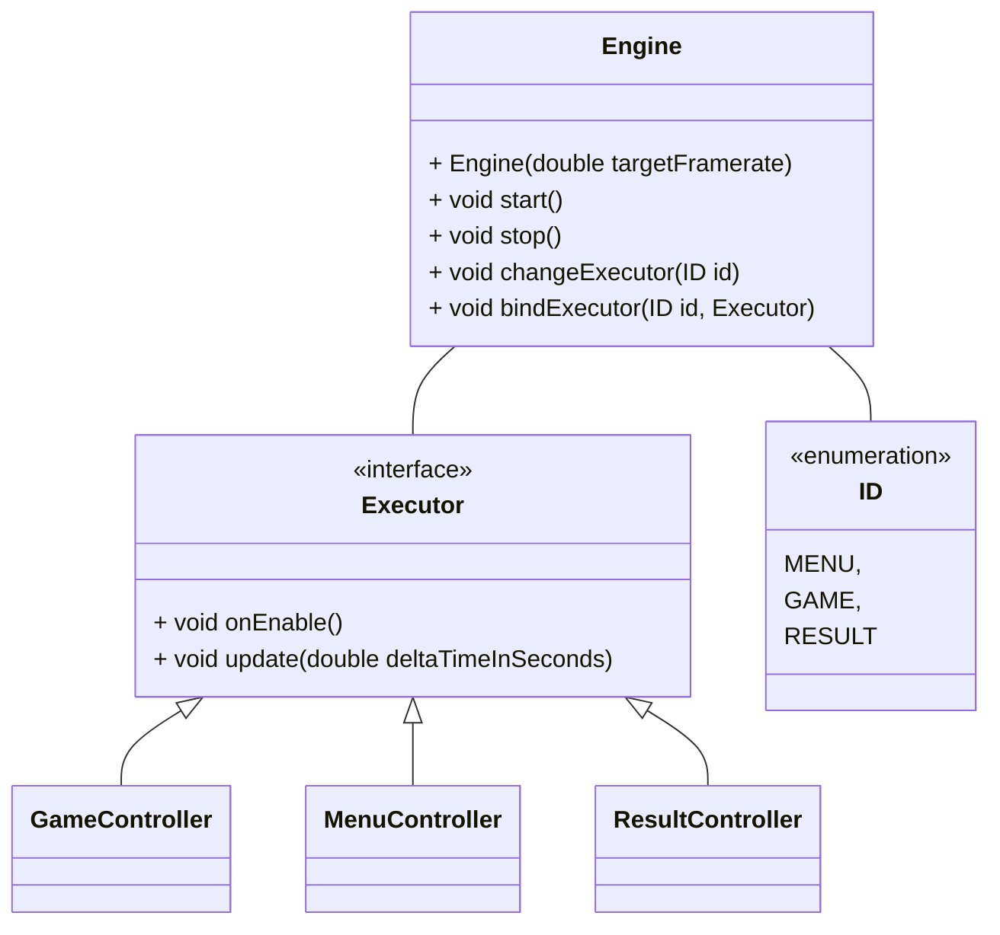

`GameController` internamente implementa le varie fasi possibili di un giocatore attraverso l'interfaccia `Context`
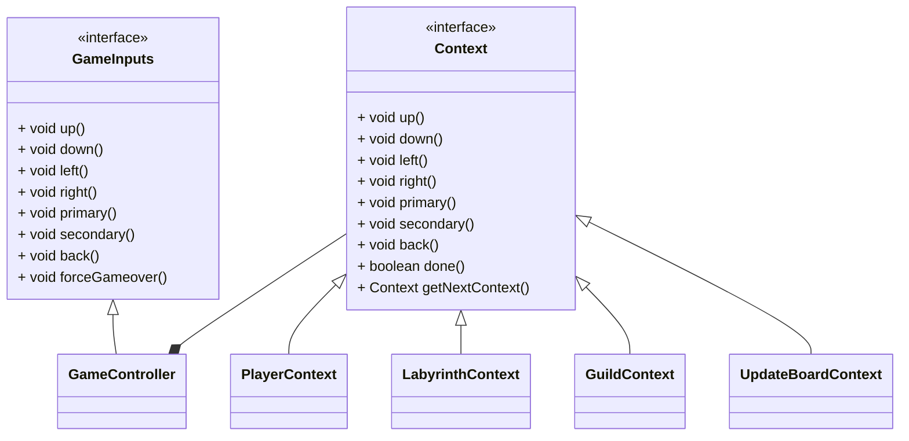

### 2.2 Design Dettagliato
#### 2.2.1 Carletti Lorenzo
- **Problema:** Il sistema deve supportare da 2 a 4 giocatori, con possibilità di estensione futura di diverse implementazioni dell'interfaccia `Player`.
**Soluzione:** Per il momento, nel progetto esiste una sola specializzazione dell'interfaccia `Player`, implementata nella classe `PlayerImpl`. Questa identifica un giocatore "classico", le cui decisioni vengono prese da una persona reale.
L'insieme dei giocatori, viene gestito dalla classe `PlayersContext` che si occupa di immagazzinare al suo interno tutti i giocatori in una Lista. Ho scelto questo particolare tipo di collezione perchè mi permette di dare un ordine ai giocatori e di accedere facilmente al giocatore che mi interessa, tramite il suo indice corrispondente. Questo indice viene utilizzato anche per identificare l' `active player`, ossia il giocatore attivo in quel momento nel gioco, perciò ho implementato un metodo `getActivePlayer` che me lo restituisce.

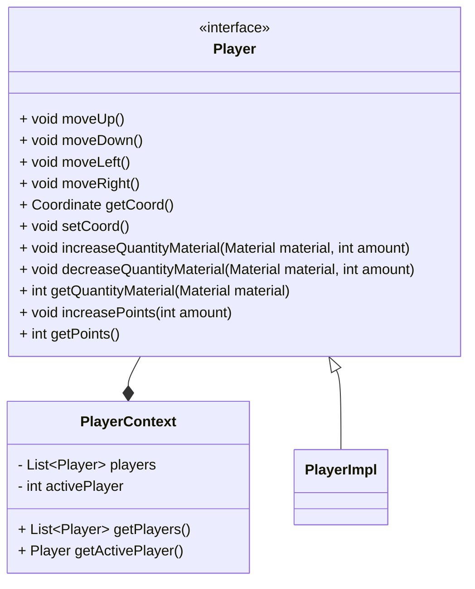

- **Problema:** Stabilire di quante posizioni i giocatori si possono spostare nel labirinto.
**Soluzione:** Per rendere il gioco più dinamico, è stato deciso di rendere casuale il numero di mosse. Per generare il numero casuale di spostamenti di un giocatore viene simulato il lancio di un dado, la cui logica è implementata nel metodo `generateDiceValue` in `PlayersContext`. Il movimento dei giocatori e il lancio del dado sono entrambi implementati all'interno della classe `PlayersContext` e insieme costituiscono la fase di movimento del giocatore. Per differenziarli correttamente ho utilizzato una `enum`, con i valori `DICE` e `MOVEMENT` per indicare quale sottofase è attiva. Il primo identifica il momento del turno in cui deve essere lanciato il dado, mentre il secondo fa riferimento alla sottofase in cui il giocatore si può muovere, fino al numero massimo di mosse stabilito dalla sottofase precedente.

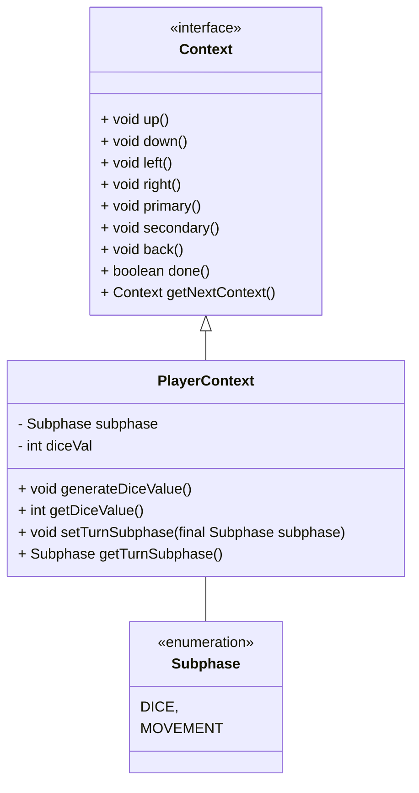

#### 2.2.2 Catena Matteo
- **Problema:** Quando si passa da un controller al successivo, questo richiede anche un trasferimento di informazioni. Un esempio di ciò è la configurazione del gioco, che deve andare dal menu al controller di gioco.
Dato che gli scambi tra controller sono di tipo circolare (da menu a gioco, da gioco a risultati, da risultati a menu), non si può mantenere nel controller di partenza il riferimento al controller successivo passandolo come parametro del costruttore
**Soluzione:** è stato utilizzato il pattern observer, definendo degli "eventi" quando è richiesto il passaggio da un controller al successivo.
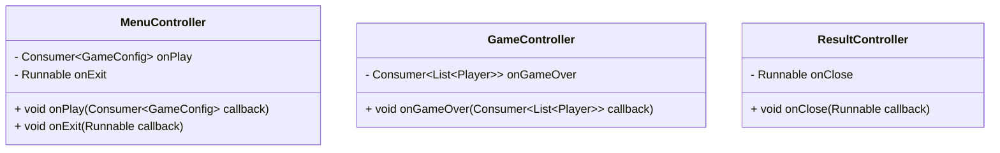
In questo modo le classi controller hanno codice concettualmente separato, senza nessun riferimento diretto al controller successivo, rendendo possibile fare uno scambio tra i controller in modo circolare e poter testare individualmente le classi in modo automatico.
Le funzioni effettive che si occupano del trasferimento dati si trovano all'interno della classe `Labyrint`, classe che definisce il metodo main dove inizia tutto il programma.

- **Problema:** Come ricevere gli input della tastiera, che vengono generati da JavaFX, per poi eseguire delle funzioni nei vari controller in modo tale da mantenere netta la separazione tra view e controller nel pattern MVC.
**Soluzione:** interfaccia `JFXInputSource` e la sua interfaccia interna `Receiver`.

Nel caso in cui la scena attiva sia quella di gioco, gli eventi seguono un percorso, attraverso classi concrete, di questo tipo:

`GameJFXView` si occupa di configurare il necessario per JavaFX in modo tale da poter spedire gli eventi della tastiera alla classe `GameInputAdapter`, passata attraverso il metodo `routeKeyboardEvents`
`GameInputAdapter` si occupa nella funzione `onKeyPressed` di ricevere gli eventi di tipo `KeyInput` e mappare i tasti necessari in chiamate di funzioni di `GameController`.
In questo modo `GameController` può definire attraverso l'interfaccia `GameInputs` le funzioni necessarie per il suo funzionamento, senza doversi preoccupare di *come* le funzioni vengono chiamate dall'esterno.

La gestione degli input per le scene `Menu` e `Result` seguono una struttura e utilizzo analoga a quella descritta per la scena `Game`.
Le classi coinvolte avranno il prefisso `Menu` oppure `Result` al posto del prefisso `Game`, ma i ruoli delle classi sono gli stessi per tutte e tre le scene.

#### 2.2.3 Dall'Ara Lorenzo
- **Problema:** Come strutturare la manipolazione delle tessere del labirinto da parte di un giocatore in modo esclusivo.
**Soluzione:** Creazione di due sottocontesti `ShifterContext` e `RotationContext` che ricevono gli input giocatore ridirezionati dalla classe proxy `LabyrinthContext`.
`ShifterContext` gestisce gli input del giocatore in un contesto riguardante lo spostamento di righe o colonne del labirinto.
`RotationContext` gestisce invece gli input in un contesto di rotazione delle tessere.
`LabyrinthContext` ha lo scopo di selezionare il sottocontesto attivo tra questi due in modo esclusivo e successivamente ridirezionare a quello attivo le chiamate di metodo.
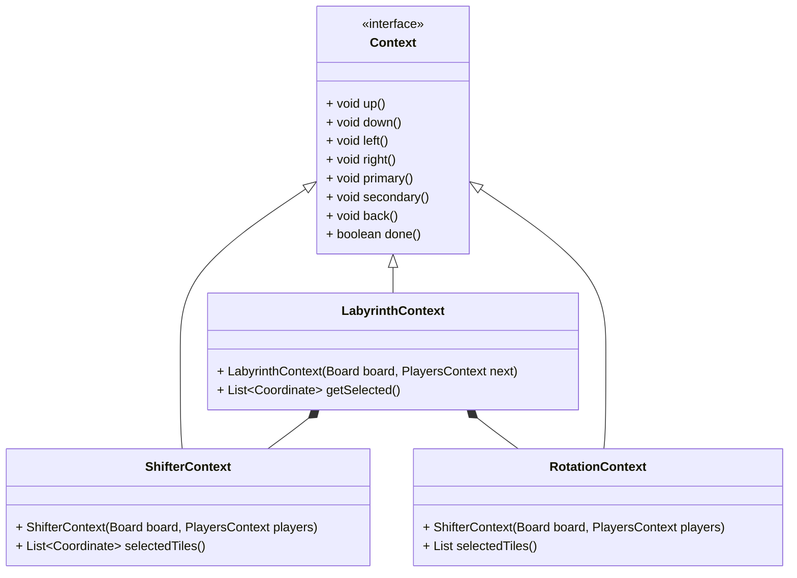
- **Problema:** Generazione casuale del labirinto contenente diversi tipi di tessere, ognuna delle quali richiede una logica di posizionamento specifica.
**Soluzione:** Creazione della classe `BoardGenerator` contenente tutte le logiche utili per il corretto posizionamento delle tessere.
Per generare le coordinate random delle `StandardTile` e le coordinate circolari delle `SourceTile` basate sul centro del labirinto la classe `BoardGenerator` sfrutta la classe `CoordinateGenerator`.
Questo componente contiene i metodi e le logiche per generare sempre una coordinata valida.
Per quanto riguarda la generazione delle coordinate di `GuildTile`, queste vengono calcolate internamente in `BoardGenerator`.
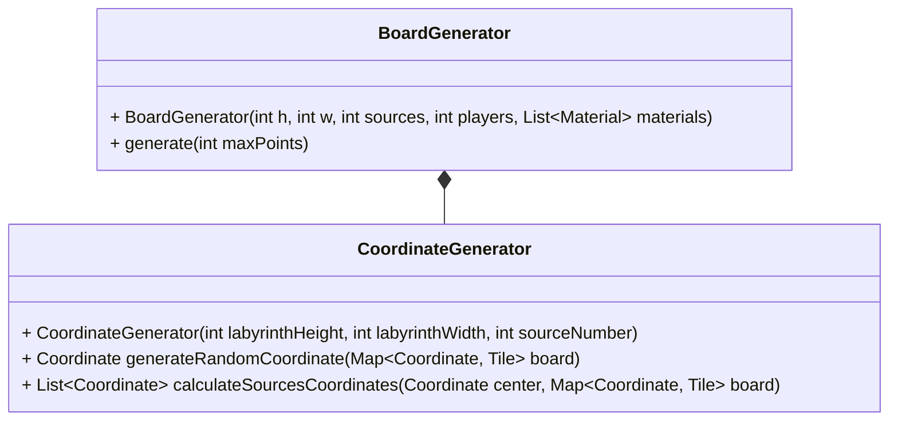

- **Problema:** Le tessere contenute nel labirinto devono essere di tipologie diverse con funzionalità uniche.
**Soluzione:** Creazione della classe astratta `GenericTile` che implementa le funzionalità comuni a tutte le tessere, in modo da poter creare delle sottoclassi specializzate in base alle diverse tipologie di tessere presenti nel gioco.
Le diverse specializzazioni attualmente presenti nel gioco sono: `StandardTile`, `SourceTile` e `GuildTile`.
`StandardTile` definisce la specializzazione inerente ad una tessera base che può contenere un materiale bonus.
`SourceTile` definisce la specializzazione per le sorgenti, tessere che rappresentano una fonte ricaricabile di materiali.
`GuildTile` infine definisce la specializzazione inerente alla tessera gilda, che permette ai giocatori di accedere alle missioni.
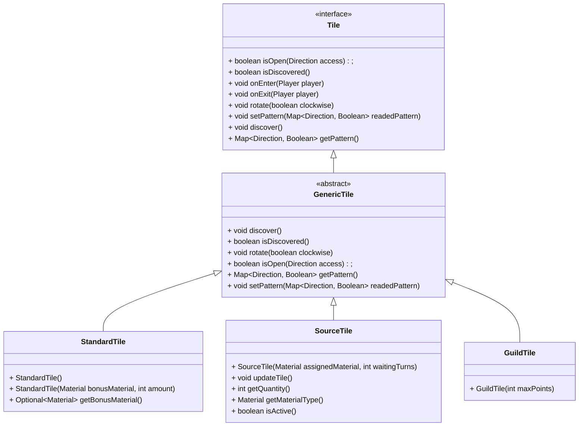
#### 2.2.4 Rocchi Mattia
**Problema:** Completamento di una missione da parte di un giocatore.
**Soluzione:** Per rendere il gioco piu dinamico, il giocatore deve trovarsi nella `GuildTile` per poter completare una missione.
`GuildContext` è il contesto che nasce proprio per la gestione delle missioni, che vengono trattate come una lista.
Infine in base alla missione selezionata viene successivamente fatto un controllo sui materiali richiesti e in possesso dal giocatore.
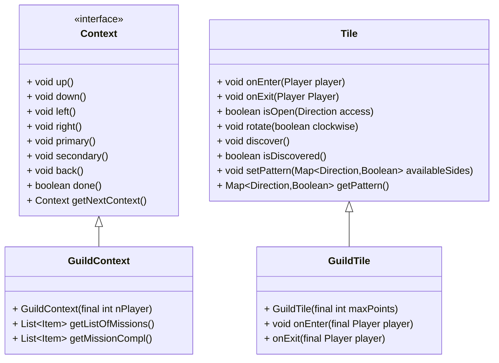

- **Problema:**  Generare missioni che soddisfano i requisiti dinamici, basati sui parametri utilizzati per generare la partita.
**Soluzione:** Suddivisione del problema nelle due classi `MissionGenerator` e `GuildContext`
`MissionGenerator` si occupa della generazione di una singola missione, ovvero un `Item`, attraverso i parametri passati da `GuildContext`.
`GuildContext` successivamente comunica con gli altri contesti presenti all'interno del game, riuscendo in questo modo a recuperare i parametri necessari per i requisiti delle missioni.
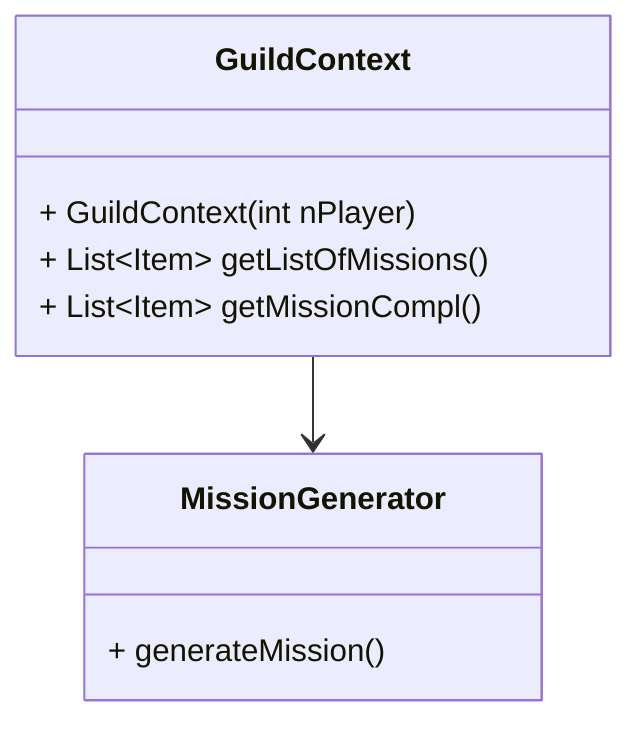
**Problema:** Gestione del caricamento di immagini da file, in modo che esse vengano caricate una sola volta e che possano essere riutilizzate in tutti i contesti all'interno del gioco.
**Soluzione:** Definizione della classe enum `ImageLoader`.
Questa classe contiene al suo interno tutti i valori identificativi di ogni immagine utilizzata.
Se una classe richiede l'utilizzo di un'immagine può ricavarla dal valore dell'enum `ImageLoader`.
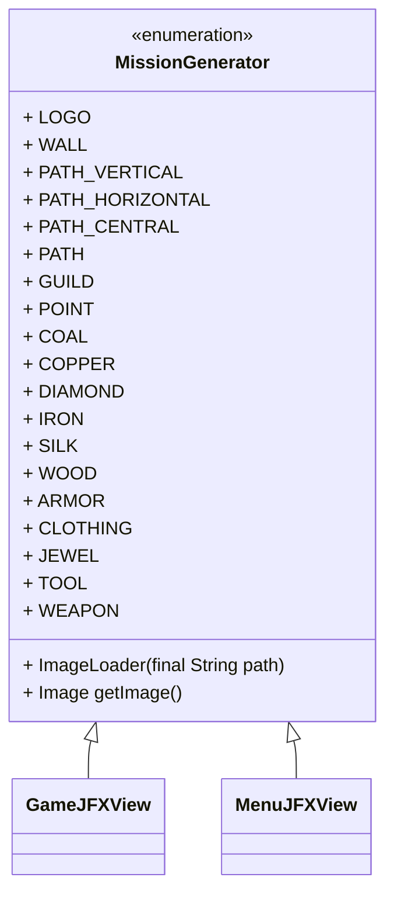

## 3. Sviluppo
### 3.1 Testing automatico
Per implementare le classi di test è stata utilizzata la suite JUnit 5. I test, tutti automatici, sono stati utilizzati per verificare il corretto funzionamento delle classi principali.
Le classi di test realizzate sono le seguenti:
- `BoardGenerationTest`: verifica la corretta generazione del labirinto e delle tessere.
- `EngineTest`: verifica il corretto funzionamento della classe Engine.
- `GuildTileTest`: verifica la generazione delle missioni, i controlli sul menu della gilda e l'attribuzione dei punti bonus.
- `ImageLoaderTest`: verifica il corretto caricamento delle immagini.
- `MenuControllerTest`: verifica il corretto funzionamento degli eventi interni alla classe MenuController.
- `MenuElementTest`: verifica il corretto funzionamento della struttura interna al menu principale.
- `PlayerTest`: verifica il movimento, l'inventario e l'attribuzione dei punti di un singolo giocatore.
- `ResultControllerTest`: verifica il passaggio di scena dai risultati al menu principale.
- `SourceTileTest`: verifica il corretto funzionamento delle sorgenti e l'attribuzione dei materiali ai giocatori.
- `TileInteractionTest`: verifica la corretta manipolazione del labirinto e delle singole tessere.

### 3.2 Note di sviluppo
#### 3.2.1 Carletti Lorenzo
- Utilizzo di JavaFX per visualizzare le informazioni dei giocatori:

https://github.com/Code-Commit-Debug-Revert/OOP23-Labyrinth/blob/f17bfa921d1e666364fe9d28fa14a5426985de3b/src/main/java/com/ccdr/labyrinth/game/GameJFXView.java#L216-L259

- Utilizzo di lambda functions:

https://github.com/Code-Commit-Debug-Revert/OOP23-Labyrinth/blob/d264903fae55bc03c3a84b93a76fa607ea7ccacd/src/main/java/com/ccdr/labyrinth/game/GameJFXView.java#L263

#### 3.2.2 Catena Matteo
- Utilizzo di JavaFX per la gestione del rendering della board.
Permalink: https://github.com/Code-Commit-Debug-Revert/OOP23-Labyrinth/blob/62a6eabb2097f136bd67356d7a97dfc31ef6979d/src/main/java/com/ccdr/labyrinth/game/GameJFXView.java#L116-L132
- Utilizzo di lambda functions, per esempio nel collegamento tra i diversi controller
Permalink: https://github.com/Code-Commit-Debug-Revert/OOP23-Labyrinth/blob/62a6eabb2097f136bd67356d7a97dfc31ef6979d/src/main/java/com/ccdr/labyrinth/Labyrinth.java#L56-L59
- Utilizzo di stream sulle collezioni
Permalink: https://github.com/Code-Commit-Debug-Revert/OOP23-Labyrinth/blob/62a6eabb2097f136bd67356d7a97dfc31ef6979d/src/main/java/com/ccdr/labyrinth/menu/MenuParticleSystem.java#L73-L75
- Utilizzo di classi generiche nuove
Permalink: https://github.com/Code-Commit-Debug-Revert/OOP23-Labyrinth/blob/62a6eabb2097f136bd67356d7a97dfc31ef6979d/src/main/java/com/ccdr/labyrinth/menu/element/MenuChoiceElement.java#L13-L99
#### 3.2.3 Dall'Ara Lorenzo
- Utilizzo di JavaFX per disegnare le tessere selezionate durante l'esecuzione di LabyrinthContext.
Permalink: https://github.com/Code-Commit-Debug-Revert/OOP23-Labyrinth/blob/d264903fae55bc03c3a84b93a76fa607ea7ccacd/src/main/java/com/ccdr/labyrinth/game/GameJFXView.java#L480-L485
- Utilizzo di Optional per l'assegnazione random di bonus alle StandardTile.
Permalink: https://github.com/Code-Commit-Debug-Revert/OOP23-Labyrinth/blob/d264903fae55bc03c3a84b93a76fa607ea7ccacd/src/main/java/com/ccdr/labyrinth/game/generator/BoardGenerator.java#L118-L134
- Utilizzo di lambda function per decidere il senso di rotazione di una tessera.
Permalink: https://github.com/Code-Commit-Debug-Revert/OOP23-Labyrinth/blob/d264903fae55bc03c3a84b93a76fa607ea7ccacd/src/main/java/com/ccdr/labyrinth/game/tiles/GenericTile.java#L45-L57
- Utilizzo di stream nell'esecuzione dei test automatici inerenti alle interazioni con il labirinto.
Permalink: https://github.com/Code-Commit-Debug-Revert/OOP23-Labyrinth/blob/d264903fae55bc03c3a84b93a76fa607ea7ccacd/src/test/java/labyrinth/TileInteractionTest.java#L44-L51
#### 3.2.4 Rocchi Mattia
- Utilizzo di JavaFx per la gestione grafica delle informazioni riguardanti le missioni.
Permalink: https://github.com/Code-Commit-Debug-Revert/OOP23-Labyrinth/blob/d264903fae55bc03c3a84b93a76fa607ea7ccacd/src/main/java/com/ccdr/labyrinth/game/GameJFXView.java#L382-L402
- Utilizzo di lambda functions
Permalink: https://github.com/Code-Commit-Debug-Revert/OOP23-Labyrinth/blob/d264903fae55bc03c3a84b93a76fa607ea7ccacd/src/main/java/com/ccdr/labyrinth/game/GameJFXView.java#L381

## 4. Commenti finali
### 4.1 Autovalutazione e lavori futuri
#### 4.1.1 Carletti Lorenzo
All'interno del progetto Labyrinth mi sono occupato principalmente della parte che si occupa della gestione dei giocatori, quindi del loro movimento, del sistema dei punti e dell'inventario dei materiali. Inoltre, tramite la libreria di JavaFX, ho anche gestito la parte grafica riguardante la rappresentazione dei giocatori sul labirinto e la visualizzazione della sezione delle statistiche.

Essendo consapevole di non eccellere nell'ambito della programmazione e del fatto che questo fosse il mio primo progetto, sono conscio che il codice da me prodotto non è di alta qualità, ma sono comunque contento e soddisfatto di ciò che ho realizzato.
La realizzazione del progetto e la sua organizzazione le ho trovate molto utili e stimolanti per capire effettivamente come si svolge la progettazione e la creazione di un'applicazione software.

Ho intenzione di continuare a sviluppare questo progetto in futuro, una delle prime cose che voglio fare è quella di implementare più specializzazioni dell'interfaccia `Player`, in modo tale da poter creare più tipi diversi di giocatori.

#### 4.1.2 Catena Matteo
Tutto sommato, sono molto contento di come il gioco è stato finalizzato e ho capito di non sottovalutare la fase di analisi.

Prima di questo progetto nei vari progetti personali per risolvere efficentemente un problema partivo dall'implementazione, da lì capivo quali erano i punti critici di questa prima implementazione.
Poi questi punti venivano sistemati in un secondo modo, che molto spesso era più semplice sia concettualmente che da implementare.
Ripetendo questo ciclo fino a che non trovavo più sezioni gravemente difficili, alla fine convergevo in una soluzione del problema.

Labyrinth è stato il primo vero progetto in cui non sono partito direttamente ad implementare, ma ho cercato effettivamente di analizzare varie soluzioni, i loro pregi e difetti e come si relazionano con il resto del progetto.
Un esempio di ciò è stato come gestire gli input da JavaFX, problema che all'inizio avevo sottovalutato gravemente e che non è stato per niente banale risolvere.
Sono fiero di come quella parte di routing degli eventi viene gestita dal gioco.

#### 4.1.3 Dall'Ara Lorenzo
Sicuramente è risultata essere una esperienza istruttiva essendo questo il mio primo progetto software basato sul paradigma OOP.
Durante lo sviluppo di questa applicazione software mi sono reso veramente conto di quanto una buona fase di analisi e soprattutto di design possa risultare vitale per creare del codice di qualità.

Ammetto che nel momento in cui sto scrivendo questo commento, mi rendo conto che magari con un pò più di riflessioni in termini di design avrei potuto produrre codice migliore.
Soprattutto non sono molto soddisfatto di come ho strutturato la classe di generazione del labirinto, perché ripensandoci ora avrei potuto strutturare meglio il tutto, sfruttando magari una variante di factory.
Sono molto soddisfatto invece della gestione tramite proxy dei contesti relativi al labirinto.
 
#### 4.1.4 Rocchi Mattia

In questo progetto mi sono occupato della Gilda con le rispettive funzioni che permettevano di interagire tra le classi missioni<->player e il caricamento di immagini da file.

Come primo progetto devo dire che sono molto soddisfatto del risultato finale, anche se non posso fare paragoni con esperienze passate.

Per quanto riguarda le difficolta riscontrate devo dire che usare javaFX per gestire tutte le parti grafiche è stata una missione, ma alla fine molto soddisfacente.
La parte che mi preoccupava di più era il riuscire a gestire un gruppo che non aveva mai lavorato in passato, ma grazie a molteplici incontri siamo riusciti sempre a tirare fuori nuove idee e metodi per migliorare creando un codice che si potrà evolvere in futuro.

Svolgere questo progetto mi ha fatto comprendere l'importanza di ogni fase della creazione di un Software dall'analisi alla conclusione.

Sono molto fiero di questo primo gioco e spero di ideare nuovi progetti con questo gruppo.

## Appendice A: Guida utente
### A.1 Scena del menu
Il menu è la prima scena visibile all'apertura di gioco, ed è impostato come una lista di opzioni che il giocatore può selezionare.
Premere `Freccia Su` per spostare il cursore verso l'alto
Premere `Freccia Giù` per spostare il cursore verso il basso
Premere `Invio` per scegliere la voce selezionata attualmente dal cursore
Premere `Escape/Backspace` per tornare indietro nel menu.

### A.2 Scena di gioco
La guida utente riguardante la fase di gioco, scritta in inglese, è inclusa all'interno del gioco, sotto la voce "How to play" nel menu principale.
La riportiamo anche qui, tradotta in italiano.

Ogni turno è strutturato nel seguente modo:
#### Fase 1: Modifica del Labirinto
In un singolo turno il giocatore può decidere di spostare righe/colonne oppure di ruotare tessere attorno a lui.
Premendo `TAB/Ctrl` si cambia tra le due possibili modalità.
##### 1.1 Modalità spostamento
`A/D` oppure `Freccia Sinistra/Destra` selezionano una colonna da muovere. `W/S` oppure `Freccia Su/Giù` selezionano una riga da muovere.
Se è stata selezionata una colonna, premere `Invio/Spazio` per muoverla verso il basso, oppure premere `Escape/Backspace` per muoverla verso l'alto
Se è stata selezionata una riga, premere `Invio/Spazio` per muoverla verso destra, oppure premere `Escape/Backspace` per muoverla verso sinistra.
##### 1.2 Modalità di rotazione
Utilizzare `W/A/S/D` oppure `Freccia Su/Sinistra/Giù/Destra` per selezionare una cella qualsiasi attorno al giocatore.
Una volta selezionata, premere `Invio/Spazio` per ruotarla in senso orario, oppure premere `Escape/Backspace` per ruotarla in senso antiorario.

#### Fase 2: Movimento dei giocatori
Premere `Invio/Spazio` per lanciare il dado, poi usare `W/A/S/D` oppure `Freccia Su/Sinistra/Giù/Destra` per spostare il giocatore.
Premere `Tab/Ctrl` per scartare le mosse rimanenti e passare alla fase successiva.

#### Fase 3: Interazione con la gilda
Questa fase si attiva soltanto se il giocatore si trova sopra alla tessera della gilda.
Premere `W/A` oppure `Freccia Su/Sinistra` per spostare il cursore verso l'alto.
Premere `S/D` oppure `Freccia Giù/Destra` per spostare il cursore verso il basso.
Premere `Invio/Spazio` per completare una missione, `Escape/Backspace` per chiudere il menu e passare al turno successivo

### A.3 Scena dei risultati
La scena dei risultati mostra una classifica dei giocatori in base ai loro punteggi.
Premere `Invio/Spazio` per ritornare alla scena di menu.

## Appendice B: Esercitazioni di laboratorio
### B.1 lorenzo.carletti3@studio.unibo.it
- Laboratorio 09: https://virtuale.unibo.it/mod/forum/discuss.php?d=149231#p211384
- Laboratorio 10: https://virtuale.unibo.it/mod/forum/discuss.php?d=150252#p212708
- Laboratorio 11: https://virtuale.unibo.it/mod/forum/discuss.php?d=151542#p213918
### B.2 matteo.catena3@studio.unibo.it
- Laboratorio 07: https://virtuale.unibo.it/mod/forum/discuss.php?d=147598#p209276
- Laboratorio 08: https://virtuale.unibo.it/mod/forum/discuss.php?d=148025#p209762
- Laboratorio 09: https://virtuale.unibo.it/mod/forum/discuss.php?d=149231#p211482
- Laboratorio 10: https://virtuale.unibo.it/mod/forum/discuss.php?d=150252#p212700
- Laboratorio 11: https://virtuale.unibo.it/mod/forum/discuss.php?d=151542#p213921
