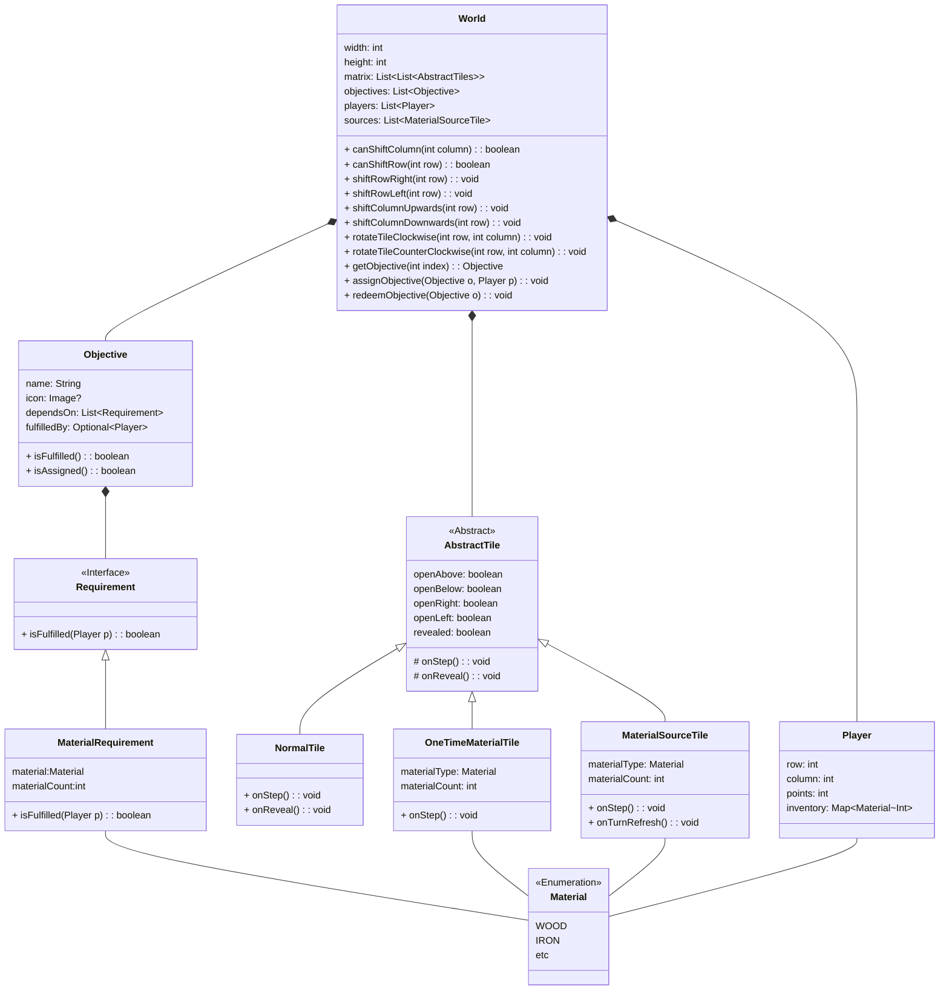

# UML
Gestione mondo + sistema obiettivi
[Link alla documentazione](https://mermaid.js.org/syntax/classDiagram.html)

## Note
* `World` è l'unico luogo dove oggetti di tipo `Objective` devono essere effettivamente contenuti, nelle altre posizioni ci deve essere sempre esclusivamente un riferimento