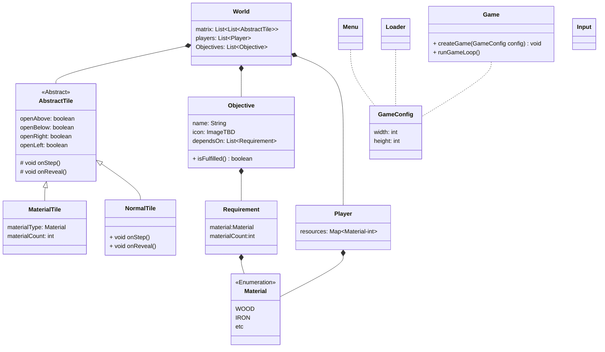

# UML
[Link alla documentazione](https://mermaid.js.org/syntax/classDiagram.html)

# Note
* `GameConfig`: Struct per contenere i parametri per creare il labirinto
* `Game`: Gestisce il loop principale di gioco
* `World`: Contiene tutto lo stato del labirinto
* `Loader`: Responsabile del caricamento delle risorse da file
* `Input`: Legge gli input da tastiera per il gioco
* `Menu`: Gestisce tutto il menu iniziale del gioco
* Le classi che non sono collegate con World sono volutamente poco descritte in modo da lasciare la maggior libertà durante lo sviluppo. Quello che è descritto nel grafico ritengo sia il minimo necessario per iniziare a sviluppare il gioco
